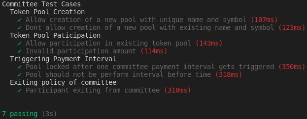

# Committee Crypto Saving System

_Deployed On Testnet (Rinkeby)_
**Token address**: ```0x6D0F42F5d9b9825420a35c7149275134145C7DEE```

## Functionalities

- A person can create a committee pool of a **certain token**
- Other people can participate in this committee pool by depositing **that** token
- Fixed deposit amount is decided by the pool creator
- At Payment intervals, a person among the participants of pool will get the committee sum amount pre-decided by the pool creator
- For Participation, participant needs to deposit their test tokens
- _Security Constraint_:- Participant will need to deposit some security money so they can be penalized if they didnt participate in committee by kicking them and getting their security amount and any other (if present)

## Committee System Testing

