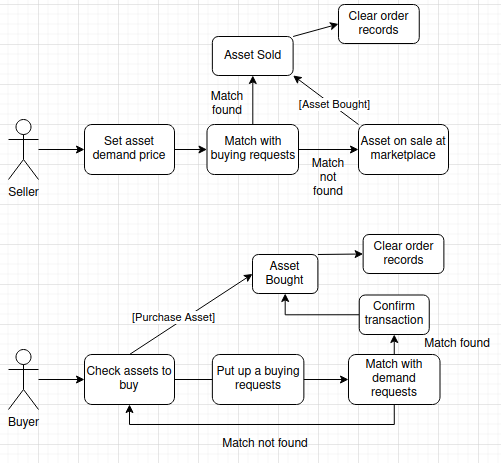

# DECENTRALIZED ORDER BOOK MARKETPLACE (HardHat)

## Simple Flowchart



## Buying

- Buyer can buy an asset
- Buying Request can be put up by buyer for an asset in a desired price

## Selling

- Seller can place an order of their asset
- Demand price can be set by the seller for an asset

## Smart Contract Working

- Match the buyers request with the matching sellers demand
- Remove both matching buying and selling request data when order finished

## Code Description

**Note: Comments are also added in code for explanation**

```
Asset[] private sellingDemands;
Asset[] private buyingRequests;
```

Arrays of assets used for the placement of demands and requests

```
function _checkDemands(string memory name, uint price) internal view returns(bool) {}
```

Internal helper function used for the checking of demands that either they are present in the marketplace or not, it will return a bool about the status of demand

```
function _checkRequests(string memory name, uint price) internal view returns(bool) {}
```

Internal helper function used for the checking of requests that either they are present in the marketplace or not, it will return a bool about the status of request

```
function _clearRecords(string memory name, uint price) internal {}
```

Internal helper function used for the clearing of records once the order finishes, returning nothing

```
function putDemand(string memory name, uint price) external {}
```

External function to be used for putting up the demand onto the marketplace which will be stored in the demand array

```
function putRequest(string memory name, uint price) external {}
```

External function to be used for putting up the request onto the marketplace which will be stored in the request array

## Project Setup

Create an empty hardhat.config.js using command `npx hardhat`<br/>
Install Hardhat using command

```
npm install --save-dev hardhat
```

## Run Tests

Install testing dependencies using commands

```
npm install --save-dev @nomiclabs/hardhat-waffle ethereum-waffle chai @nomiclabs/hardhat-ethers ethers
```

To run tests, use the commands `npx hardhat test`<br/>
Add the following line in **hardhat.config.js**

```
require("@nomiclabs/hardhat-waffle");
```


